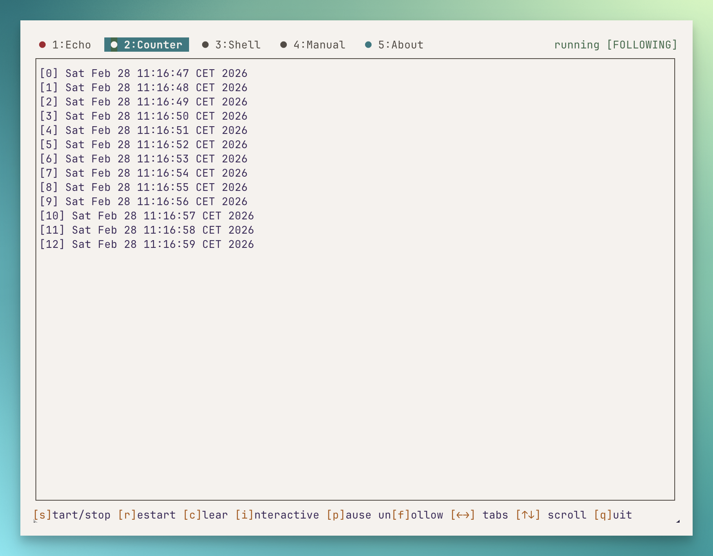

# octoplex

A terminal multiplexer TUI for running multiple commands side by side in tabs. Built with [Bun](https://bun.sh) and [Ink](https://github.com/vadimdemedes/ink).



Draws inspiration from [Solo](https://github.com/soloterm/solo) for Laravel, but framework-agnostic — works with any project.

## Install

```bash
# Global
bun add -g octoplex

# Or run directly
bunx octoplex
```

## Quick Start

Create a `.octoplex.json` in your project root:

```json
{
  "commands": {
    "Dev Server": "bun run dev",
    "Tailwind": "bunx tailwindcss -w",
    "Tests": {
      "cmd": "bun test --watch",
      "autostart": false
    }
  }
}
```

Then run:

```bash
octoplex
```

Or generate a config from your `package.json` scripts:

```bash
octoplex init
```

## Config

### `.octoplex.json`

```json
{
  "commands": {
    "Name": "command string",
    "Name2": {
      "cmd": "command string",
      "autostart": false,
      "cwd": "./subdir",
      "env": { "PORT": "3000" },
      "type": "log"
    }
  }
}
```

### `.octoplex.ts`

For dynamic configuration:

```ts
import { defineConfig } from "octoplex";

export default defineConfig({
  commands: {
    "Dev Server": {
      cmd: "bun run dev",
      autostart: true,
      env: { PORT: process.env.PORT || "3000" },
    },
  },
});
```

### Command Options

| Option | Type | Default | Description |
|--------|------|---------|-------------|
| `cmd` | string | required | Shell command to run |
| `autostart` | boolean | `true` | Start automatically on launch |
| `cwd` | string | `.` | Working directory |
| `env` | object | `{}` | Environment variables |
| `type` | `"default" \| "log"` | `"default"` | Log mode adds level colorization |

## Keyboard Shortcuts

| Key | Action |
|-----|--------|
| `←` `→` | Switch tabs |
| `1`-`9` | Jump to tab by number |
| `s` | Start/stop process |
| `r` | Restart process |
| `c` | Clear output |
| `p` | Pause/unpause (freeze view) |
| `f` | Follow/unfollow output |
| `↑` `↓` | Scroll output |
| `i` | Enter interactive mode |
| `Ctrl+X` | Exit interactive mode |
| `q` | Quit |

**Log mode extras:** `w` toggle wrap, `t` truncate log

Tabs are also clickable with the mouse.

## Features

- **Tabbed UI** — run multiple commands, switch between them
- **Autostart / Lazy** — commands start on launch or on demand
- **Scrollable output** — scroll through command output, freeze the view
- **Interactive mode** — send keyboard input to a process (shells, REPLs)
- **Log tailing** — colorizes log levels (ERROR, WARN, INFO, DEBUG)
- **Mouse support** — click tabs to switch
- **Fullscreen** — uses alternate screen buffer, restores terminal on exit
- **PTY support** — full terminal emulation via Bun.Terminal (colors, progress bars, etc.)
- **Zero native deps** — no node-pty, no compilation step

## Requirements

- [Bun](https://bun.sh) >= 1.3.5
- macOS or Linux (uses PTY, no Windows support)

## License

MIT

## Author

Tim Broddin — [titansofindustry.be](https://titansofindustry.be)
